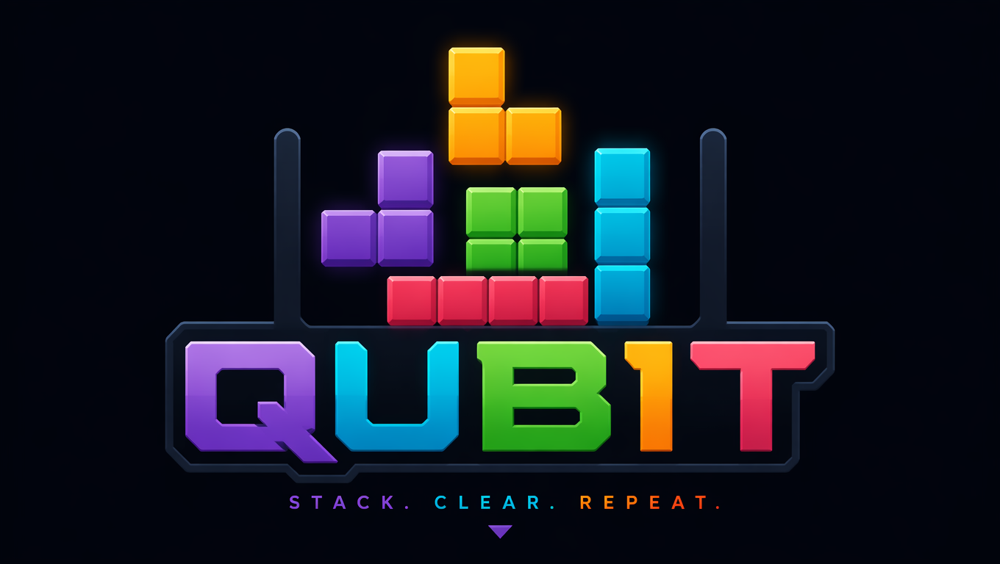

# qubit
Qubit Tetris is a browser-based, classic Tetris clone featuring colorful pieces, persistent high scores, and immersive tone-generated background music and sound effects. Built with modern JavaScript, it emphasizes modularity and clarity, making it easy to understand, customize, and extend.

## Features:

Classic Tetris gameplay with color-coded pieces.
Persistent high score leaderboard stored in localStorage.
Looping background music generated with Web Audio API tones.
Sound effects for move, line clear, and game over, also tone-based.
Modular architecture using separate JavaScript modules for clarity.
Fully playable in modern browsers.

## Overview:

Qubit Tetris is a modern, modular Tetris clone that uses tone-based sound effects and background music. Built with separate JavaScript modules, it is easy to understand, extend, and customize.

## How to Run:

Download or clone the repository.
Open index.html in a modern browser (Chrome, Firefox, Edge).

### Use arrow keys to control:

Left/Right: move pieces
Up: rotate
Down: soft drop
Spacebar: hard drop

Click Restart to start a new game.

High scores are saved automatically; view the leaderboard below the game.

## Customization Tips:

Change the melody by modifying frequencies in startMusic().
Adjust sound effect durations or tones in sound.js.
Add new shapes or colors in shapes.js.
Enhance UI or add animations for better visuals.

## Troubleshooting:

If the game isn't running when you open index.html, it might be due to a few common issues. Here's a checklist to troubleshoot and ensure everything works correctly:

1. Browser Security Restrictions

Modern browsers restrict JavaScript modules and certain features when opening files directly from the filesystem (file:// protocol).

Solution: Run a local web server instead of opening the file directly.

2. How to run a local server

Using Python (if installed):

Navigate to your project directory in the terminal or command prompt.
Run: python -m http.server (Python 3)
Open your browser and go to: http://localhost:8000

Using VSCode Live Server extension:

Install Live Server.
Open your project folder in VSCode.
Right-click index.html and select "Open with Live Server".

3. Check the Console for Errors

Open your browser's Developer Tools (F12 or right-click → Inspect → Console).
Look for error messages related to module loading or other issues.

Common issues include:

Incorrect script paths.
Syntax errors.
CORS restrictions when loading modules.

4. Ensure Correct File Paths

Your index.html references: 
Make sure the folder structure matches:
          
            
            
          
    qubit/
      ├── index.html
      ├── style.css
      └── js/
        ├── main.js
        ├── game.js
        ├── shapes.js
        └── sound.js
      
All files should be in the correct locations.

5. Verify JavaScript Compatibility

Make sure your browser supports ES6 modules (most modern browsers do).

Summary:

Never open HTML files directly from the file system (file://) in modern browsers for modules.
Use a local server (Python, VSCode Live Server, or other tools).
Check the browser console for errors and fix any path issues.

Example: Running a Simple Python Server
Open your terminal in the project directory and run:
      
            
            
          
    python -m http.server

Then go to: http://localhost:8000/index.html

## Description of Files:

    index.html: Main HTML file, loads CSS and JavaScript modules.
    style.css: Contains styling for the game UI.
    js/game.js: Core game logic, handles game loop, shape movements, collisions.
    js/shapes.js: Defines the shapes and rotations.
    js/sound.js: Manages tone generation, background music, and sound effects.
    js/ui.js: Handles UI updates like score display, leaderboard, controls.
    README.md: Project overview, setup instructions, gameplay directions.
